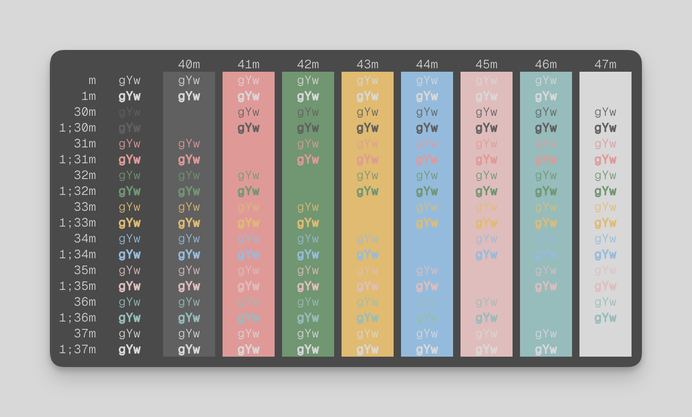

# seoul256-ghostty

A port of [seoul256](https://github.com/junegunn/seoul256.vim) color scheme to
[ghostty](https://ghostty.org/)



# Installation

```
> git clone https://github.com/jcmorrow/seoul256-ghostty
> cp seoul256-ghostty/seoul256 ~/.config/ghostty/themes/
```

Update your ghostty config:

```
theme = seoul256
```
